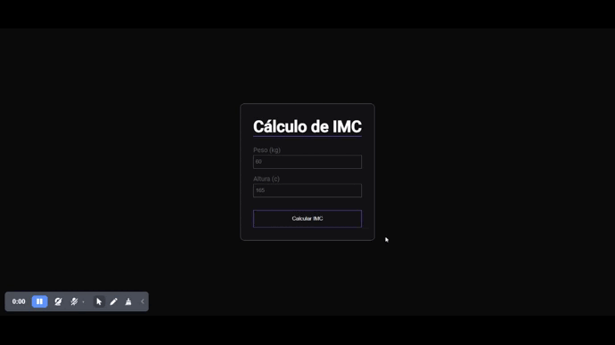

# calculadora-rocketseat
É uma aplicação que calcula o IMC.
<h1></h1>

##  Cálculo de IMC 

Esta é uma aplicação de cálculo de IMC ajuda a monitorar a saúde e bem-estar, comparando massa corporal e altura. Ela recebe as informações do usuário, calcula o IMC e mostra a classificação de acordo com a tabela.

Neste projeto pude abordar refatorização buscando um código mas limpo e de fácil manutenção, modelarizar, estrutura de dados, mudeles e validação dos dados preenchido pelo úsuario.

- Este projeto é pessoal, foi desenvolvido com conhecimento adquiridos no curso Explorer da Rocketseat

## Tecnologia Utilizada

- Javascript
- HMTL
- CSS

## Acesse o projeto

 <h3>
        <a href="https://lyrisnunes.github.io/calculadora-rocketseat/"> - Veja o projeto clique aqui </a>
</h3>

